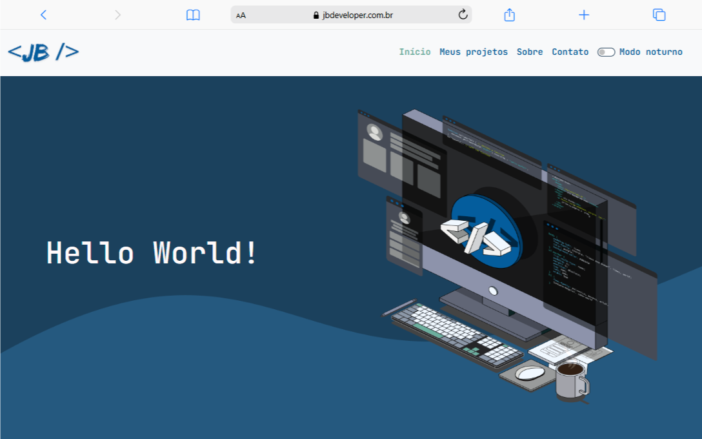

# Meu Projeto 🚀

<p align="center">
  
</p>

## 📌 Sobre o Projeto

Este é um site moderno e responsivo, desenvolvido para apresentar informações de forma clara e objetiva. Ele conta com uma interface elegante, animações suaves e validação de formulários para melhorar a experiência do usuário.

## ✨ Tecnologias Utilizadas

- **HTML5**
- **CSS3** (com variáveis e animações personalizadas)
- **JavaScript** (vanilla e manipulação do DOM)
- **Bootstrap 5**
- **EmailJS** (para envio de formulários)

## 🎨 Design e Estilo

O site segue uma identidade visual baseada em tons de azul, garantindo um aspecto profissional e agradável. O CSS inclui:

- Animação de digitação no título principal.
- Estilização personalizada da scrollbar para um toque refinado.
- Sistema de tema escuro/claro, controlado pelo usuário.

## ⚡ Funcionalidades Principais

- Navbar dinâmica com destaque automático da seção ativa.
- Validação de formulários em tempo real, garantindo entradas corretas.
- Envio de mensagens via EmailJS com feedback visual ao usuário.
- Modo Noturno que pode ser ativado/desativado pelo usuário.

## 📂 Estrutura do Projeto

```
📁 projeto
│── 📂 css
│   ├── styles.css
│── 📂 js
│   ├── script.js
│   ├── validacao-form.js
│── 📂 img
│── index.html
```

## 🚀 Como Rodar o Projeto

1. Clone o repositório:
   ```sh
   git clone https://github.com/seu-usuario/seu-repositorio.git
   ```
2. Acesse o diretório do projeto:
   ```sh
   cd seu-repositorio
   ```
3. Abra o `index.html` no navegador.

## 📬 Contato

Se quiser bater um papo sobre tecnologia ou desenvolver um projeto comigo, entre em contato:

- 📧 **E-mail:** ubiratanbernardo@outlook.com
- 🔗 **LinkedIn:** [linkedin.com/in/ubiratanbernardo](https://linkedin.com/in/ubiratanbernardo)
- 🐙 **GitHub:** [github.com/birajnior](https://github.com/birajnior)

---

🚀 **Desenvolvido por Ubiratan Júnior &lt;JB /&gt;**

